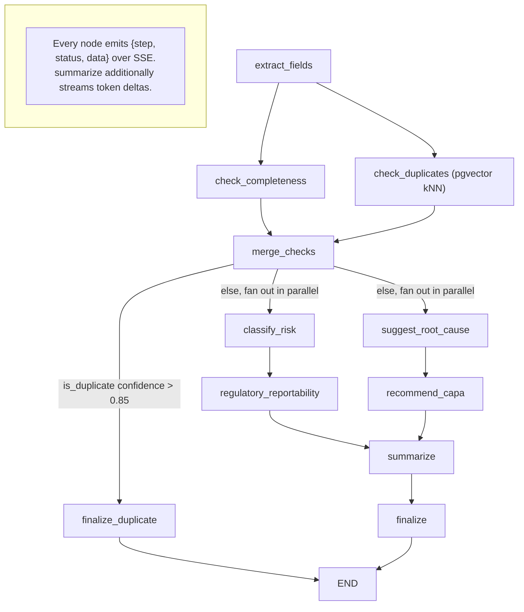
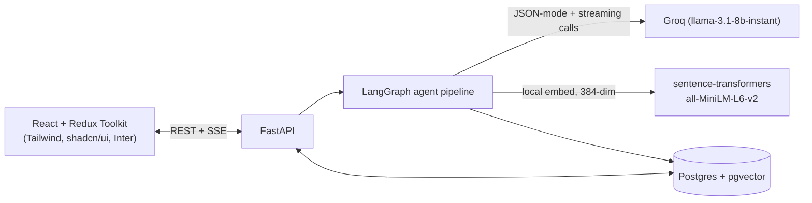

# AIVOA Complaint Management System

## What this is

This is a submission for the **AIVOA Round 1 AI Product Engineer (Interns)** assignment:
an AI-powered Customer Complaint Management System for the pharmaceutical
manufacturing industry (API/FDF QMS domain). A reviewer pastes free text or uploads a
PDF/email complaint; a LangGraph agent pipeline (running on Groq-hosted
`llama-3.1-8b-instant`, model name env-configurable via `GROQ_MODEL`)
extracts structured fields, checks completeness, searches for semantic duplicates
against prior complaints (pgvector), classifies patient-safety risk, flags regulatory
reportability, suggests a root cause, recommends CAPA actions, and produces a
reviewer-facing summary — all streamed live over SSE to a React/Redux "AI Copilot"
stepper. The reviewer then edits/approves the AI-populated "Log Customer Complaint"
form, and every edit is written to an audit trail. The stack is React + Redux Toolkit
(Tailwind + shadcn/ui, Inter font), FastAPI, LangGraph, Groq, and Postgres + pgvector,
wired up as a single `docker compose up --build`.

## Architecture





## Quickstart

```bash
cp .env.example .env        # fill in GROQ_API_KEY (get one at console.groq.com)
docker compose up --build   # starts db (5432), backend (8000), frontend (5173)
python backend/scripts/seed.py   # seeds 6 demo complaints, incl. a near-duplicate pair
```

Then open **http://localhost:5173**. Paste a complaint on `/intake` and watch the AI
Copilot stepper run live; submit a complaint that closely resembles the seeded
`Amoxicillin 500mg` / batch `B10021` pair (yellow-tinted tablets, off smell) to see
duplicate detection fire in real time.

The backend also runs standalone: `cd backend && uvicorn app.main:app --reload` (with
`db` up and `.env` loaded) and the frontend with `cd frontend && npm run dev`.

## Running tests

```bash
cd backend && pytest
cd frontend && npm run test
```

Backend tests are weighted more heavily (per the assignment's evaluation focus): one
pytest module per LangGraph node with a mocked Groq client, a full-graph integration
test covering both the normal path and the duplicate short-circuit path, and API
endpoint tests via `httpx`/`TestClient`. Frontend has RTL coverage for the intake form
and the AI Copilot stepper against a mocked stream.

## Rubric mapping

| Requirement | Implementation | Key file(s) |
|---|---|---|
| **Mandatory** — Complaint intake (paste text / upload PDF / upload email) | `/api/complaints/intake` accepts `{text}` or a `.pdf`/`.eml` multipart upload, extracting raw text before handing it to the agent graph | [`backend/app/api/intake.py`](backend/app/api/intake.py), [`backend/app/services/file_parsing.py`](backend/app/services/file_parsing.py), [`frontend/src/pages/Intake.tsx`](frontend/src/pages/Intake.tsx) |
| **Mandatory** — AI-assisted structured "Log Customer Complaint" form | LLM (JSON mode) extracts product/batch/customer/description/category/source with a per-field confidence score; reviewer edits the auto-populated form and saves via `PATCH` | [`backend/app/agents/nodes/extract_fields.py`](backend/app/agents/nodes/extract_fields.py), [`frontend/src/features/complaints/ComplaintForm.tsx`](frontend/src/features/complaints/ComplaintForm.tsx) |
| **Mandatory** — "AI Copilot Risk Assessment" panel | Renders completeness, duplicate warning + link, risk + rationale, regulatory reportability, root cause, CAPA, and summary next to the form | [`frontend/src/features/complaints/RiskAssessmentPanel.tsx`](frontend/src/features/complaints/RiskAssessmentPanel.tsx) |
| **Mandatory** — React + Redux Toolkit, FastAPI, LangGraph, Groq, Postgres+pgvector, Inter font | Redux store/slices, RTK Query API layer, FastAPI app, compiled `StateGraph`, `AsyncGroq` client, `pgvector.sqlalchemy.Vector` column, `@fontsource/inter` import | [`frontend/src/store.ts`](frontend/src/store.ts), [`frontend/src/services/api.ts`](frontend/src/services/api.ts), [`backend/app/main.py`](backend/app/main.py), [`backend/app/agents/graph.py`](backend/app/agents/graph.py), [`backend/app/services/groq_client.py`](backend/app/services/groq_client.py), [`backend/app/db/models.py`](backend/app/db/models.py), [`frontend/src/main.tsx`](frontend/src/main.tsx) |
| **Bonus** — Completeness Checker | Rule-based check against required QMS fields (product, batch/lot, description, date) producing a `completeness_score` and `missing_fields` list | [`backend/app/agents/nodes/check_completeness.py`](backend/app/agents/nodes/check_completeness.py) |
| **Bonus** — Root Cause Recommendation | LLM proposes a Man/Machine/Material/Method/Environment root-cause category with rationale | [`backend/app/agents/nodes/suggest_root_cause.py`](backend/app/agents/nodes/suggest_root_cause.py) |
| **Bonus** — Duplicate Complaint Detection | Local `sentence-transformers` embedding + pgvector cosine-similarity kNN, pre-filtered by same product + batch/lot within a rolling window; hard duplicates (>0.85) short-circuit the graph, "possible duplicates" (0.70–0.85) surface as a warning without dropping the complaint | [`backend/app/agents/nodes/check_duplicates.py`](backend/app/agents/nodes/check_duplicates.py), [`backend/app/db/repository.py`](backend/app/db/repository.py), [`backend/app/services/embeddings.py`](backend/app/services/embeddings.py) |
| **Bonus** — CAPA Recommendation | LLM proposes one concrete corrective and one preventive action tied to the suggested root cause | [`backend/app/agents/nodes/recommend_capa.py`](backend/app/agents/nodes/recommend_capa.py) |
| **Bonus** — Complaint Summary | LLM produces a concise reviewer-facing summary; tokens are streamed live over SSE as they're generated | [`backend/app/agents/nodes/summarize.py`](backend/app/agents/nodes/summarize.py), [`frontend/src/features/intake/useIntakeStream.ts`](frontend/src/features/intake/useIntakeStream.ts) |
| **Bonus** — AI Risk Classification | LLM classifies patient-safety risk as Critical/Major/Minor with rationale | [`backend/app/agents/nodes/classify_risk.py`](backend/app/agents/nodes/classify_risk.py) |
| **Addition (not in rubric)** — Regulatory Reportability | LLM flags whether the complaint pattern would typically trigger a regulatory report (adverse event, field alert), with rationale — a 7th signal added because it's directly relevant to the pharma QMS domain | [`backend/app/agents/nodes/regulatory_reportability.py`](backend/app/agents/nodes/regulatory_reportability.py) |
| **Addition** — Audit trail | Every reviewer edit to a complaint (field, old/new value, who, when) is recorded and rendered as a timeline on the detail page | [`backend/app/db/models.py`](backend/app/db/models.py) (`ComplaintStatusHistory`), [`backend/app/api/complaints.py`](backend/app/api/complaints.py) (`/history`), [`frontend/src/features/complaints/AuditTrailTimeline.tsx`](frontend/src/features/complaints/AuditTrailTimeline.tsx) |
| **Addition** — Deterministic trace replay | The full step-by-step agent trace is stored per complaint and replayable via `GET /{id}/trace` without re-invoking the LLM | [`backend/app/agents/tracing.py`](backend/app/agents/tracing.py), [`backend/app/api/complaints.py`](backend/app/api/complaints.py) (`/trace`) |

## Design decisions worth calling out

- **LangGraph branching/parallel design.** `extract_fields` fans out to
  `check_completeness` and `check_duplicates` concurrently, both join at `merge_checks`,
  and only *after* that join does a conditional edge decide whether to short-circuit to
  `finalize_duplicate` or fan out again into `classify_risk` and `suggest_root_cause` in
  parallel (each with its own downstream node, rejoining at `summarize`). The
  short-circuit branch is deliberately attached to the join's outgoing edge rather than
  `check_duplicates`'s own edge — see the comment in
  [`backend/app/agents/graph.py`](backend/app/agents/graph.py) — because LangGraph's
  fan-in fires as soon as any incoming edge delivers a write, so attaching the
  conditional earlier would let `check_completeness`'s plain edge drag `merge_checks`
  forward regardless of the duplicate outcome, defeating the short-circuit.
- **pgvector semantic duplicate search vs. naive matching.** Rather than fuzzy string
  matching on description text, complaints are embedded locally
  (`all-MiniLM-L6-v2`, 384-dim, no external API call needed for this step) and compared
  via pgvector cosine-similarity kNN, pre-filtered to the same product + batch/lot
  within a configurable window (`DUPLICATE_WINDOW_DAYS`). Two independently-written
  complaints describing the same defect in different words (e.g. "yellow discoloration
  and an unusual odor" vs. "yellow-tinted tablets with an off smell") are still caught,
  which keyword matching would miss.
- **SSE token streaming.** The intake endpoint streams `{step, status, data}` events
  for every node as it runs (`started`/`completed`/`error`), and the `summarize` node
  additionally streams individual token deltas via `langgraph`'s `get_stream_writer()`
  — so the reviewer sees the AI-generated summary appear incrementally rather than
  waiting on a single blocking response, giving real visible feedback that the pipeline
  is doing genuine LLM work rather than a canned response.

## Documented fast-follows

These were deliberately deferred to protect the one-day build budget — scope cuts,
not oversights:

- **Auth/RBAC.** No login, sessions, or per-role permissions; every endpoint is
  currently open. A real deployment would need reviewer/admin roles gating who can
  edit complaints or view PII (`customer_name`/`customer_contact`).
- **PDF export.** The completed investigation (complaint + AI assessment + audit
  trail) is only viewable in-app; there's no "export to PDF" for a QMS record-keeping
  workflow.
- **Alembic migrations.** Schema is created via `Base.metadata.create_all()` on
  startup rather than versioned migrations — fine for a from-scratch demo, not for
  evolving a production schema.
